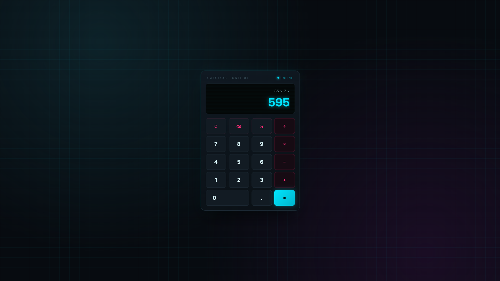

# CALC//OS — Arithmetic Terminal

A sleek calculator web app built as part of OIBSIP WebDev Level 2. The UI mimics a futuristic terminal display while providing basic arithmetic operations, percent, clear, and backspace support.

## Features

* Responsive calculator interface with advanced visual styling
* Supports addition, subtraction, multiplication, division
* Percent conversion and decimal entry
* Clear (`C`) and backspace (`⌫`) controls
* Keyboard input support for digits, operators, Enter, Escape, Backspace, and `%`
* Error handling for division by zero

## Project Files

* `index.html` — page structure and button layout
* `style.css` — custom futuristic design and responsive layout
* `script.js` — calculator logic, screen updates, and keyboard handling

## Usage

1. Open `index.html` in a browser.
2. Use the on-screen buttons or keyboard to enter numbers and operators.
3. Press `=` or Enter to calculate the result.
4. Use `C` to reset and `⌫` to delete the last digit.

## Keyboard Support

* `0`–`9` — digit entry
* `.` — decimal point
* `+`, `-`, `*`, `/` — operators
* `Enter`, `=` — calculate result
* `Backspace` — delete last digit
* `Escape` — clear all
* `%` — percent conversion

## Notes

This project is designed for learning and demonstration. It uses plain HTML, CSS, and vanilla JavaScript without any external frameworks.
