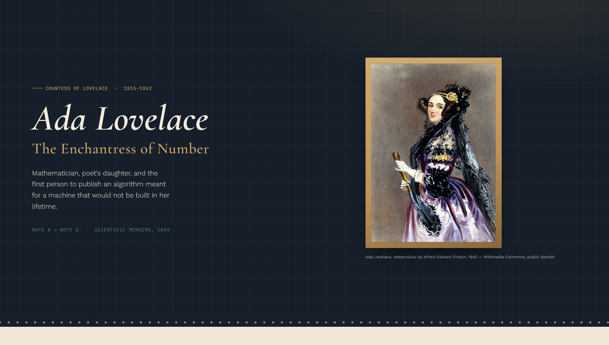

# Ada Lovelace Tribute Page

A complete responsive static tribute page celebrating Ada Lovelace, built with HTML and CSS and styled using Google Fonts.

## Overview

The page highlights Ada Lovelace with a dramatic hero section, a biography section, milestone cards, a featured quote, and a legacy summary. It is designed to showcase elegant typography, visual hierarchy, and responsive layout for both desktop and mobile screens.

## Features

- Responsive hero layout with typography-driven design
- Image frame and caption for the portrait section
- Biography section with decorative initial letter styling
- Timeline-style milestone cards for key events
- Quote plaque with accent borders and dark theme
- Legacy list section summarizing Ada Lovelace's influence
- Static page with optional script support for subtle animations

## Files

- `index.html` — page content and section structure
- `style.css` — styling, layout, and responsive rules
- `script.js` — optional page behavior and animation support

## Usage

1. Open `index.html` in a browser.
2. Optionally serve the folder via a local server for local development.
3. Review the layout and styles in `style.css`.

## Notes

- The design uses fonts loaded from Google Fonts.
- GSAP is included for optional scroll-based animation enhancements.
- This is a static frontend project with no build tool required.
